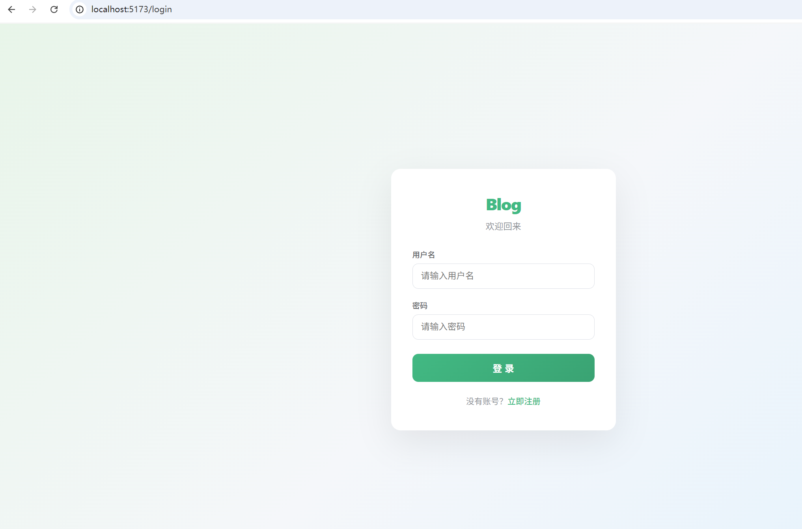
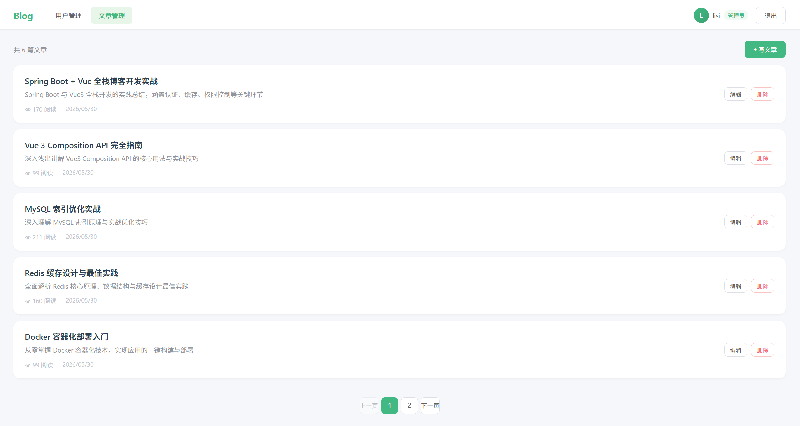
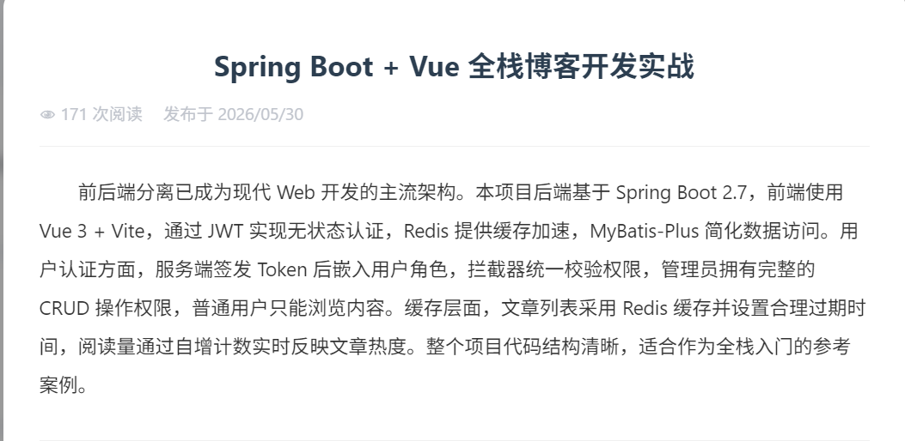
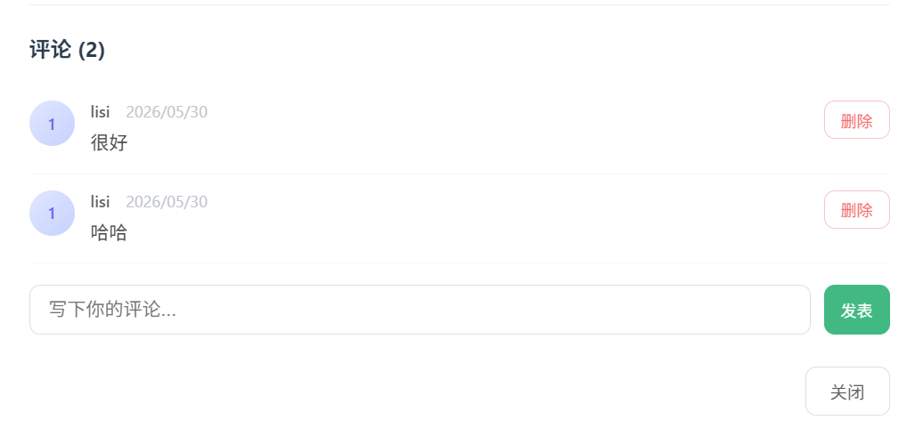

# springboot-vue-blog

基于 Spring Boot 2.7 + Vue 3 + MyBatis-Plus + Redis + JWT 的前后端分离博客系统。

## 功能

- 用户注册/登录（JWT 认证）
- 角色权限（管理员/普通用户）
- 文章管理（发布/编辑/删除/分页/浏览量）
- 评论系统（发表/删除）
- 分类与标签管理
- Redis 缓存

## 技术栈

| 层级 | 技术 |
|------|------|
| 后端 | Spring Boot 2.7、MyBatis-Plus 3.5、Spring Security、JWT、Redis |
| 前端 | Vue 3、Vue Router、Axios、Vite |
| 数据库 | MySQL |

## 快速开始

1. 创建 MySQL 数据库 `blog`，执行 `seed.sql` 建表
2. 启动 Redis
3. 配置 `application-dev.yml` 中的数据库连接
4. 后端: `cd blog-backend && mvn spring-boot:run`
5. 前端: `cd blog-frontend && npm install && npm run dev`
6. 访问 `http://localhost:5173`
7. 默认管理员: 注册后在数据库中将 `role` 改为 `admin`

## 效果截图

| 登录 | 文章列表 |
|------|---------|
|  |  |

| 文章详情 | 评论 |
|---------|------|
|  |  |
